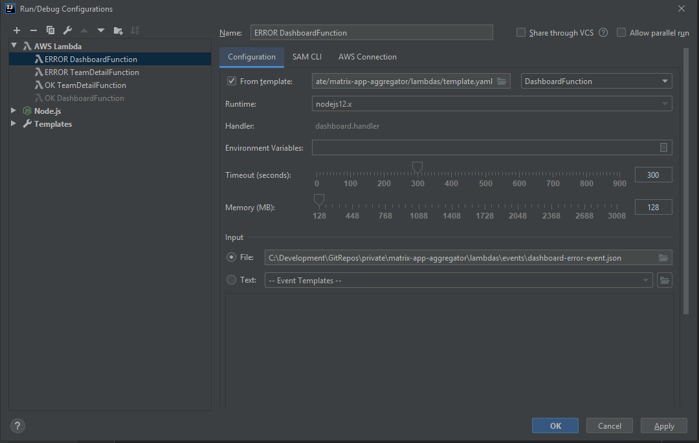

# matrix-app-aggregator-lambda-example
Example how to build metrics application with AWS Lambdas

## Project structure
This repository simulates aggregator backend of Metrics App. It contains multiple testing lambda functions, simulation of python tests and CI/CD pipeline with all necessary AWS configuration. 

* `template.yaml` -  AWS SAM configuration file where all AWS resources are defined. AWS SAM is used as AWS infrastructure as a code (instead of terraform, puppet, ansible, chef)
* `samconfig.toml` - default values of parameters like stack name, region, etc.
default value of stack name should be [github repository name]-dev, e.g. metrics-app-aggregator-dev. 
  * using this file, dev deploy is done via simple commands `sam build && sam deploy` without need to provide any other parameters
  * using this file, prod deploy is done via simple commands `sam build && sam deploy` with only a few additional parameters: `--parameter-overrides Stage=prod release=<tag or branch> --stack-name <stack name>-prod --no-fail-on-empty-changeset`
* folder `events` - contains json files for local testing of lambda functions. Simulates events sent to lambda functions from AWS API Gateway (when lambda function is connected to API Gateway endpoint - REST API) or from CloudWatch Events (when lambda function is scheduled to run periodically via CloudWatch Event Rules)
* folder `functional-tests` - tests that should be run against application deployed to dev environment. Can be (don't have to be) connected to prod deploy - if tests pass, prod deploy happens.
* folder `metrics-collector` - lambda function that simulates data collector. This function is triggered periodically based on cron expression and is NOT connected to any REST API. Stores data to AWS DynamoDB.
* folder `metrics-common-lib` - contains separate library or common module that can contain common functionality and once built and published to package registry (similar to maven central in java) it then can be used in other projects
* folder `metrics-common-lib-usage` - lambda function as an example how to use common-lib module
* folder `metrics-dashboard` - lambda function that simulates aggregator dashboard REST API (teams stats). It is connected to API Gateway `/dashboard` endpoint
* folder `metrics-dynamodb` - 2 lambda functions as example how it can read and write data from / to DynamoDB tables. They are connected to API Gateway `/dynamodb-read` and `/dynamodb-write` endpoints
* folder `metrics-secured-backend` - lambda function that simulates how lambda and API Gateway can be connected to AWS Cognito as authentication service. It requires valid Cognito JWT in `Authorization` header. It also shows how clientId can be read from received JWT. It is connected to API Gateway `/secured-backend` endpoint. If it is called without valid AWS Cognito JWT token, it returns HTTP 401
* folder `metrics-team-detail` - ambda function that simulates aggregator team detail REST API. It is connected to API Gateway `/team-detail` endpoint
* folder `.github/workflows` contains all defined Github Actions workflows as CI/CD pipelines
  * `main.yml` - for fully automated CI/CD when prod deploy happens after successful functional tests
  * `prod-deploy-on-http-request.yml` - for manual triggering of prod deploy. More info [here](https://github.com/msolanikova/matrix-app-docs/tree/master/development-process/README.md#2-manual-prod-deploy-on-demand-on-approval)
  * `prod-deploy-on-tag.yml` - for prod deploy when release tag is created. More info [here](https://github.com/msolanikova/matrix-app-docs/tree/master/development-process/README.md#3-manual-prod-deploy-on-release-tag-creation-the-best)
  * `prod-rollback-on-http-request.yml` - for manual rollback to previously deloyed tag. More info [here](https://github.com/msolanikova/matrix-app-docs/tree/master/development-process/README.md#3-manual-prod-deploy-on-release-tag-creation-the-best)
* folder `.vscode` - contains lauch configuration for Visual Studio Code necessary for invoking and debugging lambda functions locally. More info [here](https://github.com/msolanikova/matrix-app-docs/tree/master/development-process/README.md#invoking-and-debugging-lambda-function-locally)

## How to run examples locally

### Tools for local development
- install [Docker](https://www.docker.com/products/docker-desktop) and start it
- install [AWS CLI](https://aws.amazon.com/cli/)
    - aws configure
    - use credentials from Files section in Teams -> Metric App Kosice -> General
    - use eu-central-1 region
    - use json as default output format
- install [AWS SAM](https://aws.amazon.com/serverless/sam/)

### Invoking and debugging Lambda function locally
   - before lambda functions can be invoked locally, docker needs to be running
   - [with Visual Studio Code](https://docs.aws.amazon.com/serverless-application-model/latest/developerguide/serverless-sam-cli-using-debugging-nodejs.html). Please notice `.vscode/launch.json` configuration for debugging is included in this repository.
   - with Intellij Idea
       - install [AWS Toolkit plugin](https://plugins.jetbrains.com/plugin/11349-aws-toolkit)
       - create Run/Debug Configuration of type AWS Lambda (provide path to template file and input file representing event object)
       

### Publishing common library (module)
Example of common module (library) is in `metrics-common-lib` folder. In order to use this module in other projects without the need to copy it to other projects (to other lambda functions that are then deployed to AWS), it needs to be published to some package registry. For node.js there are couple of options:
- to use a public registry https://registry.npmjs.org/ (similar to maven central in java). All published modules (libraries) are then public
- to use [Github Packages](https://help.github.com/en/packages) public registry. It's still public and published modules can be used anywhere in github. It's not possible to delete such packages (or their versions)
- to use [Github Packages](https://help.github.com/en/packages) private registry (associated with private repository). Modules here can be shared within organisation or with collaborators. Each github account has by default 500MB of storage (1GB data transfer per month) for free. More info about Github Packages billing [here](https://help.github.com/en/github/setting-up-and-managing-billing-and-payments-on-github/about-billing-for-github-packages). 

This example of common module was **published to public github registry** (second option) as all Metrics App repositories are currently public. 

Publishing can be automated using Github Actions, but for now it will be a manual process. Repository owner (or collaborator with github token able to publish) has to go through following steps:
* `package.json` of given common module should contain `publishConfig` property containing registry url. This can also be configured in `.npmrc` (local npm config file), but using `package.json` clearly states for **everyone** where this module is pulished
```json
"publishConfig": {
  "registry": "https://npm.pkg.github.com"
}
```
* configure your local `.npmrc` file with registry and github token with publishing permissions. Either copy/paste example `.npmrc` and modify username or follow these steps:
  * `npm login --registry=https://npm.pkg.github.com`. (If proper `.npmrc` file already exists, login is no longer necessary.) On prompt enter:
    * your github username
    * github token with write:package permissions as password 
    * public email
  * add registry to `.npmrc` by running `npm config set registry https://npm.pkg.github.com/msolanikova` (replace `msolanikova` with your account where package should be published)
  * see more info about [Configuring npm for use with GitHub Packages here](https://help.github.com/en/packages/using-github-packages-with-your-projects-ecosystem/configuring-npm-for-use-with-github-packages)
  * `.npmrc` file should look similar to this (with some real token with write package permissions). Replace `msolanikova` with account name where package should be published
  ```
  //npm.pkg.github.com/:_authToken=realtokenwithWRITE_PACKAGEpermissions
  registry=https://npm.pkg.github.com/msolanikova
  ```
  * in case there are multiple accounts where modules are published, `.npmrc` file could look like following:
  ```json
  //npm.pkg.github.com/:_authToken=realtokenwithWRITE_PACKAGEpermissions
  registry=https://npm.pkg.github.com/msolanikova
  @msolanikova:registry=https://npm.pkg.github.com
  @otheraccount:registry=https://npm.pkg.github.com
  ```
* install your module locally by `npm install`
* publish module by `npm publish`

### Using common library locally
Once common library is published to a registry, it can be used in other projects. On any machine where common module should be used and installed via `npm install`, proper `.npmrc` file must exist 
* create `.npmrc` file similar to ones in previous chapter
* dependency of common module should contain scope: `@account/packagename`
  * e.g. `"@msolanikova/matrix-app-aggregator-common-lib": "1.0.2"` 
* run `npm install`
* more info about [installing a package can be found here](https://help.github.com/en/packages/using-github-packages-with-your-projects-ecosystem/configuring-npm-for-use-with-github-packages)